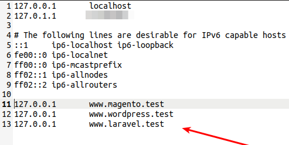

 

###  Apache, PHP7.3, MySQL Docker Compose Project - Starter for building LAMP Web Apps using Docker

#### Magento, WordPress & Laravel Docker Compatible

- Includes Apache, PHP7.3, MySQL5.7, PHPMyAdmin & Redis/OpCache
- PHP Extensions - curl, json, zip, mbstring, gettext, exif, imagick
- Includes Git2 & Composer2
- Includes 3 Virtual Host (http://www.wordpress.test & http://www.magento.test & http://www.laravel.test) 
- Includes all PHP Extension for WordPress & Magento2.3.x & Laravel 8
- .env file is used for Environment Variables.
- Solved PHPMyAdmin Error - The phpMyAdmin configuration storage is not completely configured, some extended features have been deactivated.
- Fully Compatible with Magento2.3.6 & WordPress 5.8.3
- Adds Default User other than Root User

### Prerequisites:

You must have Docker Installed in your System ! Docker version >= 20.10.x & Docker Compose version >= 1.25.x

### How to use this Docker Compose
`$ docker-compose build --no-cache`

`$ docker-compose up -d --remove-orphans`

#### Then you can check the status of the containers by running:
`$ docker ps`

 

#### Docker Bash:
`$ docker exec -it lampp-php7.3 bash`

### Docker Laravel Commands
`$ php artisan serve --host=www.laravel.test --port=8000`

 

### Url Links
1. [LocalHost (http://localhost)](http://localhost "Localhost")
2. [PHPMyAdmin (http://localhost:8080)](http://localhost:8080 "PHPMyAdmin")

### Virtual Host
1. [WordPress (http://www.wordpress.test)](http://www.wordpress.test "WordPress")
2. [Magento (http://www.magento.test)](http://www.magento.test "Magento")
3. [Laravel (http://www.laravel.test)](http://www.laravel.test "Laravel")

**Dont Forget to Add it to your Host File**
1. Windows Host File - `c:\Windows\System32\Drivers\etc\hosts`
2. Ubuntu Host File - `sudo nano /etc/hosts`

**ADD THESE**

1. `127.0.0.1 	www.magento.test`
2. `127.0.0.1 	www.wordpress.test`
3. `127.0.0.1 	www.laravel.test`

 

### WordPress & Magento Test Screenshots

 
 
 
 
 
 
 
 

### Laravel Test Screenshots
 
 
 
 

### Download Links for Magento & WordPress
1. [Download Magento 2.3.6 (https://magento.com/tech-resources/download)](https://magento.com/tech-resources/download "Download Magento 2.3.6")
 

2. [Download WordPress 5.8.3 (https://wordpress.org/download/releases/)](https://wordpress.org/download/releases "Download WordPress 5.8.3")
 

> This is a Non Production Docker Compose. This is just for Local Test Development
